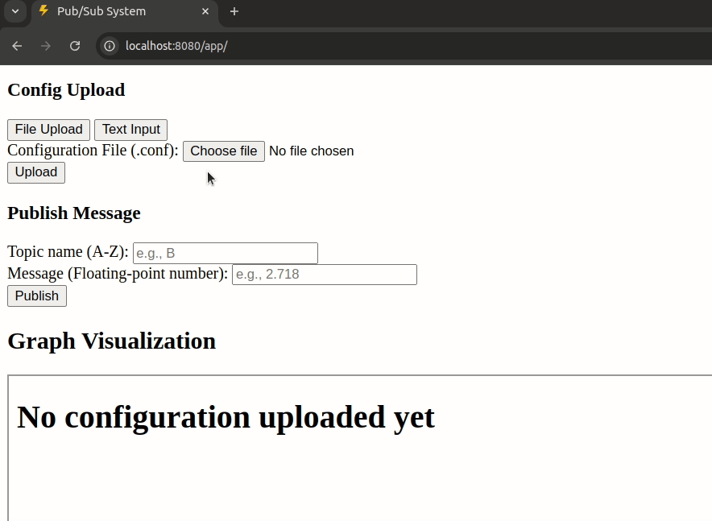

# Pub/Sub System

A flexible and interactive publish-subscribe messaging system with real-time graph visualization.



## Background

This project implements a pub/sub (publish-subscribe) system for message distribution and processing. 

Key features:
- Dynamic configuration of pub/sub topologies using text or file-based configs
- Real-time message publishing with immediate graph visualization

## System Overview

The system allows users to create custom pub/sub networks where:

- **Topics** serve as message channels
- **Agents** process input messages and publish results to output topics
- **Messages** contain numeric values that flow through the network
- **Visualization** shows the real-time state and message flow of the system

Users can design their own processing networks using configuration files or select from pre-built templates.

## Requirements

- Java 8 or higher
- Web browser (Chrome, Firefox, Safari, or Edge recommended)
- Internet connection for loading external libraries (vis-network.js)

## Installation

1. Clone the repository:
```bash
git clone https://github.com/yourusername/ap-project.git
cd ap-project
```

2. Compile the Java code:
```bash
mkdir -p out
javac -d out -cp . src/**/*.java src/*.java
```

## Running the Application

1. Start the server:
```bash
java -cp out Main
```

2. Open your web browser and navigate to:
```
http://localhost:8080/app/
```

## Project Structure

- `src/` - Java source code
  - `Main.java` - Entry point for the application
  - `servlets/` - HTTP request handlers
  - `server/` - HTTP server implementation
  - `graph/` - Graph visualization components
  - `configs/` - Configuration handling
- `web/` - Frontend files
  - HTML, CSS, and JavaScript files for the user interface 